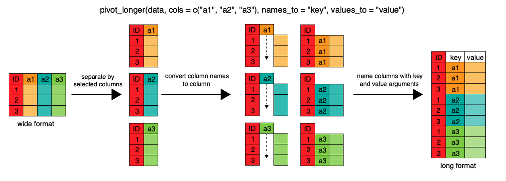

> This tutorial is based on: https://swcarpentry.github.io/r-novice-gapminder/14-tidyr/

### Background

The most recent update of the {tidyr} package includes several new functions. Here I will introduce two of them, `pivot_longer()` and `pivot_wider()`, that improve on the original functions `gather()` and `spread()`. The older functions aren't going away, but all support and future updates will be based on the new functions, so we might as well get with the program now. 

### Getting started

Load up the tidyverse:

```{r, warning=F, message=F}
library(tidyverse)
```

Read in a "wide" version of the Gapminder socioeconomic dataset from the Software Carpentries website:

```{r}
gap_wide <- read_csv("https://raw.githubusercontent.com/swcarpentry/r-novice-gapminder/gh-pages/_episodes_rmd/data/gapminder_wide.csv")
```

Check out the column names and the first few rows of `gap_wide`. 

```{r}
colnames(gap_wide)
```

```{r}
head(gap_wide)
```

Notice that there is data in the column names (i.e. years), so this is not a "tidy" dataset. If we want to do any plotting or analysis, we will likely need to convert the data from "wide" to "long" format. 

### From wide to long: `pivot_longer()` (formerly known as `gather()`)

Here are some helpful diagrams from the original tutorial, depicting our wide data and the steps to make it long.




The new pivot_longer() includes functions to gather and separate multiple columns in a single command. Previously this would have required multiple iterations of `gather()` and `separate()`.

There are 3 types of observations in this dataset: gdpPercap, lifeExp, and pop. 

Here's how you would lengthen this dataframe the old way:

```{r}
gap_wide %>% 
  gather(c(-continent, -country),
         key = "obstype_year",
         value = "value")
```

And here it is using the new way:

```{r}
gap_wide %>% 
  pivot_longer(cols = c(-continent, -country),
               names_to = "obstype_year",
               values_to = "value")
```

Notice that the obstype_year column still contains two pieces of information.

Here's how we would have separated that column into two using the old method:

```{r}
gap_wide %>% 
  gather(c(-continent, -country),
         key = "obstype_year",
         value = "value") %>% 
  separate(obstype_year,
           into = c("obstype", "year"),
           sep = "_")
```

And here's how we can do it with a single command the new way:

```{r}
gap_wide %>% 
  pivot_longer(cols = c(-continent, -country),
               names_sep = "_",
               names_to = c("obstype", "year"),
               values_to = "value")
```

Finally, notice that the new `year` is in character format, but we'll probably need it to be an integer for future analyses. We can also specify that ahead of time in `pivot_longer()`.

```{r}
gap_long <- gap_wide %>% 
  pivot_longer(cols = c(-continent, -country),
               names_sep = "_",
               names_to = c("obstype", "year"),
               values_to = "value",
               names_ptypes = list(year = integer()))

gap_long
```

Now we can use the tidy dataset to do things like group_by, summarize, and plot!

```{r}
gap_long %>% 
  filter(obstype == "gdpPercap") %>% 
  group_by(continent, year) %>% 
  summarise(mean_gdp = mean(value)) %>% 
  ggplot(aes(x = year, y = mean_gdp, color = continent)) +
  geom_line()
```

### From long to wide: `pivot_wider()` (formerly known as `spread()`)

Suppose you now want to look at the relationship between GDP and life expectancy. You will need to spread those observations back out into new columns.

Here's how we would have done it the old way:

```{r}
gap_long %>% 
  spread(key = "obstype", value = "value")
```

And here's the new way:

```{r}
gap_intermediate <- gap_long %>% 
  pivot_wider(names_from = obstype,
              values_from = value)

gap_intermediate

# note that you don't need quotes around obstype and year because they are variables
```

We can now use this intermediate dataframe for plotting.

```{r}
gap_intermediate %>% 
  group_by(continent) %>% 
  ggplot(aes(x = log10(gdpPercap), y = lifeExp)) +
  geom_point() +
  geom_smooth(method = "lm")
```

If you want to go a step further and pivot the dataframe all the way back to the original wide format:

```{r}
gap_wide2 <- gap_long %>% 
  pivot_wider(names_from = c(obstype, year),
              values_from = value)

gap_wide2
```

Note that `pivot_wider()` automatically separates variable names with an underscore if you have multiple variables in the `names_from =` argument. You can change this as follows:

```{r}
gap_long %>% 
  pivot_wider(names_from = c(obstype, year),
              values_from = value,
              names_sep = ":")
```

### Bonus: Check your dataframe

Here's a handy way to check whether our widened dataframe (`gap_wide2`) is indeed the same as our original dataframe (`gap_wide`).

```{r}
all_equal(gap_wide, gap_wide2)
```

This function lets you know if the number of rows or columns are not the same:

```{r}
test <- gap_wide2 %>% filter(continent != "Oceania")
all_equal(gap_wide, test)
```
```{r}
test2 <- gap_wide2 %>% select(-gdpPercap_1952)
all_equal(gap_wide, test2)
```

### Resources

The official {tidyverse} vignette about pivoting: https://tidyr.tidyverse.org/articles/pivot.html

The original Software Carpentries tutorial: https://swcarpentry.github.io/r-novice-gapminder/14-tidyr/

Great blog post demonstrating pivot_longer() and pivot_wider(): https://www.fromthebottomoftheheap.net/2019/10/25/pivoting-tidily/

More about the other new functions in {tidyr}: https://www.tidyverse.org/blog/2019/09/tidyr-1-0-0/
